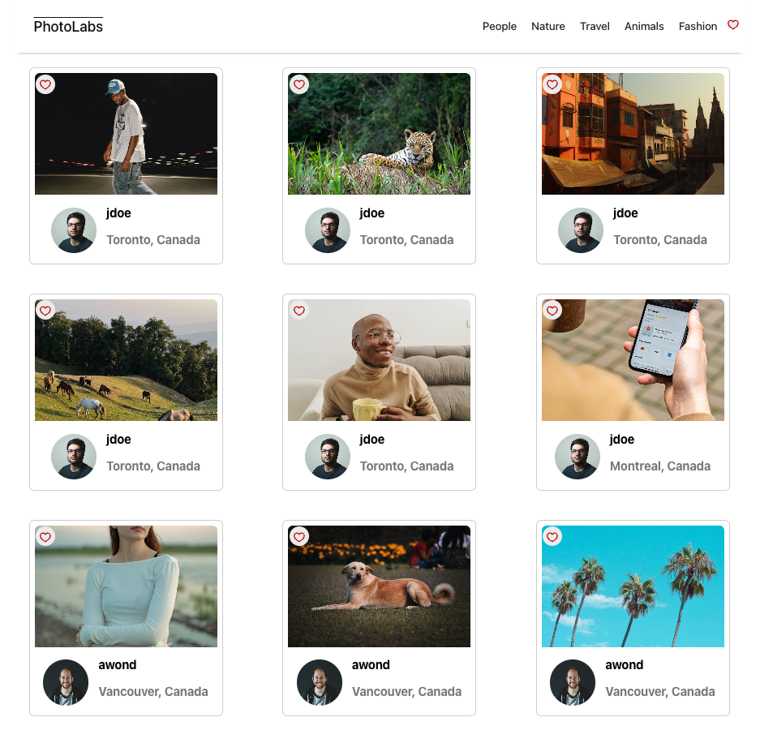
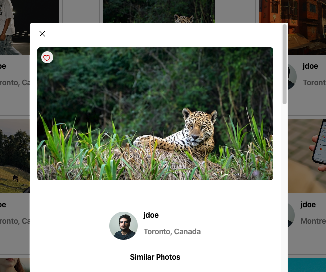
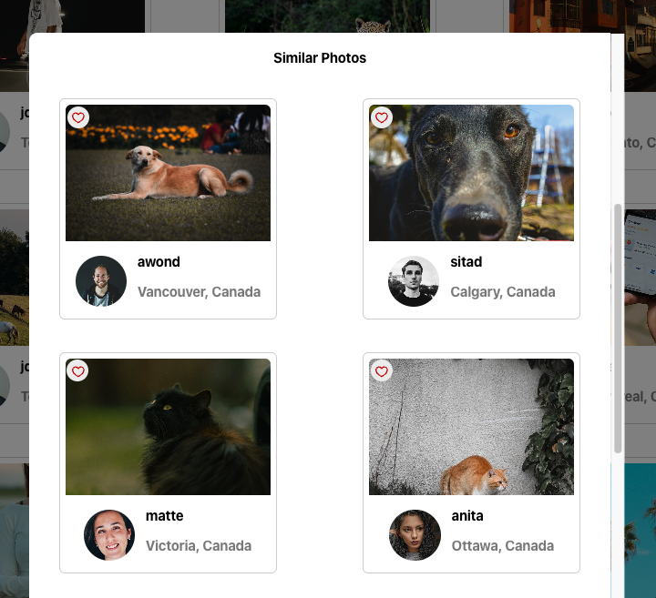
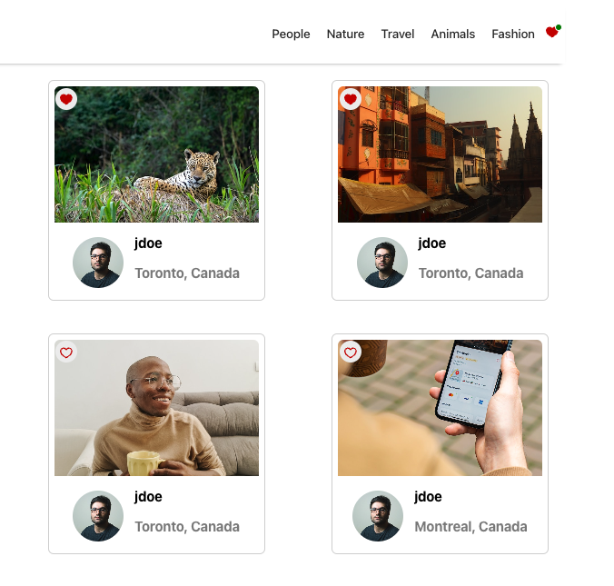
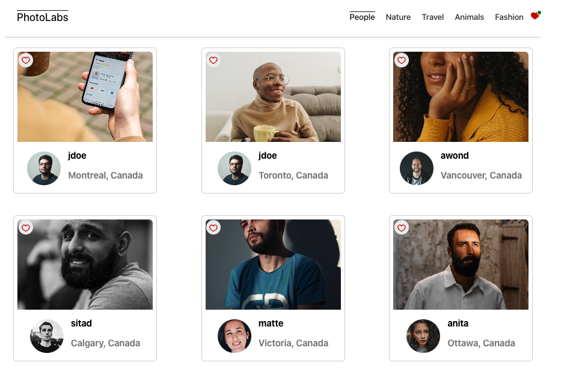

# PhotoLabs

**PhotoLabs** is a React-based single-page application (SPA) that allows users to browse and interact with a collection of photos.
## Project Description

As a student taking the website development bootcamp through Lighthouse Labs, I built PhotoLabs to help enhance my knowledge of React, Node.js, Express, and PostgreSQL. This project offers users a platform to view and interact with photos in various contexts.

## Functional Requirements

Here's an overview of its core functionalities:

### Client-Side
- Built with **React**, utilizing **Create React App** for setup and development.
- A single-page application (SPA).

### Server and Persistence Layer
- **PostgreSQL** database for data storage.
- **Node.js** and **Express** for the API server, handling backend operations.
- API communication over HTTP using the JSON format for efficient data exchange.

## Behavioural Requirements

PhotoLabs offers an intuitive and user-friendly interface with the following features:

- **Homepage Photo Viewing**: Users can view a variety of photos loaded from the API on the homepage.
- **Topic Navigation**: Users can seamlessly navigate between different photo categories (topics).
- **Photo Zoom-In**: Clicking on a photo opens a larger version along with similar photos.
- **Like Photos**: Users can like photos from any part of the application.
- **Heart Icon Notification**: A heart icon in the navigation bar keeps track of liked photos.

## Technical Specifications

Key technologies include:

- **React**: The core library for building the user interface.
- **Create React App**: For bootstrapping the project.
- **Webpack**: Module bundler for managing project assets.
- **Babel**: JavaScript compiler to ensure cross-browser compatibility.
- **Express**: Backend framework for building the API server.

## API References

The following API endpoints facilitate data fetching and interaction:

- **GET /api/photos**: Fetches all photos for the homepage.
- **GET /api/topics**: Retrieves all available photo topics.
- **GET /api/topics/photos/:topic_id**: Fetches photos for a specific topic.

## Notable Files and Structure

Key files and their roles in the project include:

- **App.jsx**: The main component that ties everything together.
- **HomeRoute.jsx**: Manages the home view, displaying photos and handling topic navigation.
- **PhotoDetailsModal.jsx**: Displays a larger version of the photo and similar photos in a modal.
- **useApplicationData.js**: Custom hook for data fetching and state management.
- **styles**: Directory containing SCSS files for styling the application.
- **assets**: Directory containing images and other static assets.

## Getting Started

To get PhotoLabs up and running on your local machine, follow these steps:

1. **Clone the repository**: `git clone https://github.com/your-username/photolabs.git`

Install dependencies with `npm install` in each respective `/frontend` and `/backend`.

## [Frontend] Running Webpack Development Server

```sh
cd frontend
npm start
```

## [Backend] Running Backend Servier

Read `backend/readme` for further setup details.

```sh
cd backend
npm start
```
5. **Visit the application**: Open your browser and navigate to `http://localhost:3000`

## Screenshots

### Home Page


### Modal


### Similar Photos


### Favourite Icon


### Filter By Topic



## Contributors

The support of the mentors at Lighthouse Labs, as well as the developer community and the tools they provide were invaluable in completing this project.

---

Thank you for checking out PhotoLabs. 


